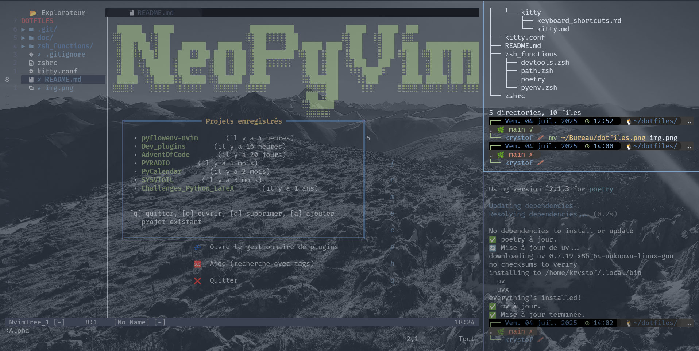

# 🛠️ Dotfiles 

Ce dépôt contient la configuration complète de mon environnement shell, basé sur [ZSH](https://www.zsh.org/), avec un accent particulier pour le développement [Python](https://www.python.org/): gestion des outils comme [pyenv](https://github.com/pyenv/pyenv), [poetry](https://python-poetry.org/), et [uv](https://docs.astral.sh/uv/). J'utilise le terminal [kitty](https://sw.kovidgoyal.net/kitty/) avec une configuration personnalisée que j'allie à une configuration toute aussi personnalisée de [Neovim](https://neovim.io/) : cf. [NeoPyVim](https://github.com/Krystof2so/NeoPyvim) et le plugin [pyflowenv-nvim](https://github.com/Krystof2so/pyflowenv-nvim).



---

## 📁 Structure du dépôt

```txt
.
├── kitty.conf                  # Configuration du terminal Kitty
├── README.md                   # Documentation du dépôt (ce fichier)
├── zshrc                       # Fichier principal de configuration ZSH
└── zsh_functions/              # Fonctions ZSH personnalisées
    ├── devtools.zsh            # Mise à jour automatisée des outils Python
    ├── path.zsh                # Configuration personnalisée des chemins
    ├── poetry                  # (Placeholder ou futur script lié à Poetry)
    └── pyenv.zsh               # Initialisation de pyenv
```
---

## 🐚 `.zshrc` – Configuration principale

Le fichier `.zshrc` configure :
- 🎨 Un prompt personnalisé avec date, heure, chemin, environnement virtuel, et état **Git**
- [Zinit](https://github.com/zdharma-continuum/zinit) comme gestionnaire de *plugins* **ZSH**
- 🧠 Fonctions shell personnalisées (`update-devtools`, `aptiup`, etc.)
- 🐍 Environnement Python : `pyenv`, `poetry`, `uv`, et leur mise à jour automatique
- 🔄 Mises à jour hebdomadaires de **Zinit** et des outils de dev
- 📦 Alias utiles, complétions automatiques, et options du shell

---

## ⚡ `zsh_functions/` – Fonctions personnalisées
### 🔧 `devtools.zsh`

Contient la fonction `update-devtools`, qui met à jour **pyenv** et ses plugins, ainsi que **poetry** (via `poetry self update`) et **uv** (via le script officiel `Astral.sh`).

🗓️ Une fois par semaine, `update-devtools` est appelé automatiquement lors du démarrage du shell grâce à la fonction `devtools_auto_update`.

### 🧭 `path.zsh`

Configure ou ajuste les chemins d'exécution (`$PATH`, etc.).

### 🧪 `pyenv.zsh`

Script d'initialisation spécifique à **pyenv**, chargé au démarrage pour s’assurer que les versions **Python** installées via **pyenv** sont disponibles dans l’environnement *shell*.

---

## 🔌 Plugins *ZSH* via *Zinit*

Le fichier `.zshrc` utilise **Zinit** pour gérer les *plugins* :

| Plugin                              | Description                                  |
| ----------------------------------- | -------------------------------------------- |
| `zsh-users/zsh-autosuggestions`     | Suggestions de commandes depuis l’historique |
| `zsh-users/zsh-syntax-highlighting` | Coloration syntaxique temps réel             |
| `zsh-users/zsh-completions`         | Complétion enrichie pour de nombreux outils  |

🛠️ **Zinit** et tous les *plugins* sont mis à jour automatiquement chaque semaine (`zinit_auto_update`).

---

## 🧠 Commandes et fonctions utiles
1. `update-devtools` (dans `devtools.zsh`) : Met à jour **pyenv**, **poetry**, et **uv**. Appelée automatiquement chaque semaine.
2. `aptiup` : Met à jour la base de paquets et lance `aptitude` uniquement si des mises à jour sont disponibles.
3. `zinitup` : Met à jour manuellement **zinit** et tous les *plugins*.

---

## ⚡ Alias pratiques

| Alias      | Description                                    |
| ---------- | ---------------------------------------------- |
| `apti`     | Raccourci pour `sudo aptitude`                 |
| `aptiup`   | Mise à jour conditionnelle via `aptitude`      |
| `cleanapt` | Nettoyage de `aptitude autoclean && clean`     |
| `dotfiles` | Accès rapide au dépôt de dotfiles              |
| `pyt`      | Lance `python3`                                |
| `lua`      | Lance `lua5.4`                                 |
| `lsa`      | Raccourci pour `ls -la`                        |
| `icat`     | Utilise `kitten icat` pour afficher des images |
| `adios`    | Éteint le système via `systemctl poweroff`     |
| `reboot`   | Redémarre le système                           |

--- 

## 🖥️ Terminal *Kitty* (`kitty.conf`)

Le fichier `kitty.conf` contient la configuration pour le terminal **Kitty**. Cette configuration inclut des réglages comme :
- L'utilisation du thème [Nord](https://www.nordtheme.com/)
- Le rendu graphique
- etc.

---

## 📦 Dépendances

Pour profiter pleinement de cette configuration, il est nécessaire d'installer préalablement :
- **ZSH**
- **Zinit**
- **pyenv**
- **poetry**
- **uv**
- **aptitude** (Sous **Debian**/**Ubuntu**)
- Terminal **Kitty**

---

## 🚀 Installation
```zsh
git clone https://github.com/<ton-nom-utilisateur>/dotfiles ~/dotfiles
ln -sf ~/dotfiles/zshrc ~/.zshrc
source ~/.zshrc
```

